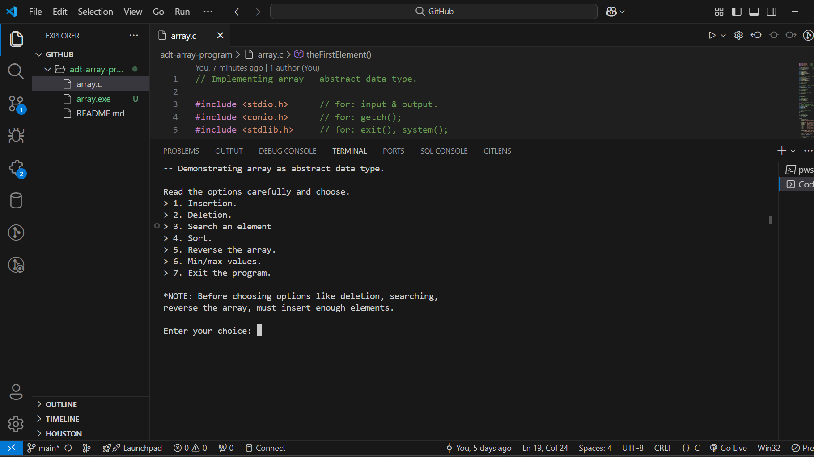
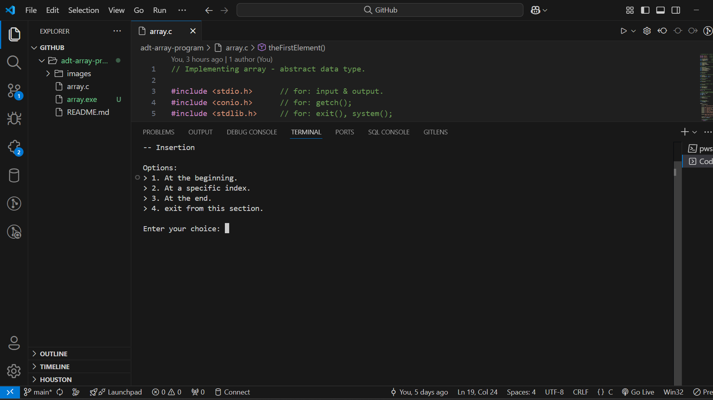
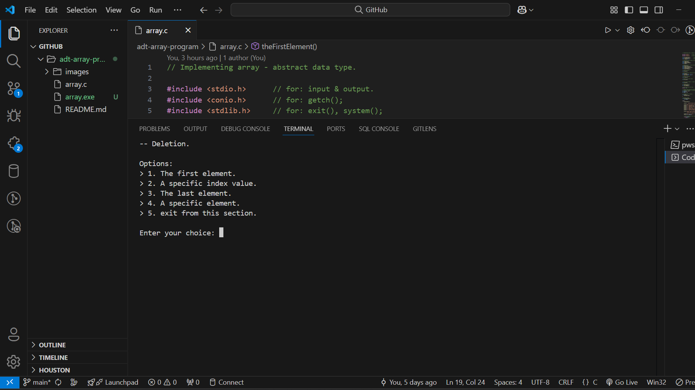

# adt-array-program
A simple C program implementing and demonstrating operations on array. Designed to help beginners understand operations related to array.



<!--
## Index
1. [Features](#features)
2. [Project Structure](#project-structure)
3. [Requirements](#requirements)
4. [Program Variables](#program-variables)
5. [Insertion Operations](#insertion-operations)
6. [Deletion Operations](#deletion-operations)
7. [Search Function](#search-function)
8. [Sort Function](#search-function)
9. [Reverse Function](#reverse-function)
10. [Min/max Function](#min-max-function)
11. [Helper Functions](#helper-functions)
-->

## Features
- Operations including: [Insertion](#insertion-operations), [Deletion](#deletion-operations), [Search](#search-function), [Sort](#search-function), [Reverse](#reverse-function), [min/max](#min-max-function).
- Menu-driven program for easy interaction.
- Simple and clean code structure.

## Project Structure
```
adt-array-program/
|-- array.c  # Main program implementing ADT arrays
|-- README.md  # Project documentation
```

## Requirements
- **C Compiler** (GCC, MinGW, or any compatible)
- **VS Code** or any code editor

## Installation Guide
- Clone the repository using HTTP/SSH URL.
```bash
git clone https://github.com/gulshan-41/adt-array-program.git
```
- Navigate to the project directory.
```bash
cd adt-array-program
```

## Program Variables
- int array[n] = {0};
- head = 0;
- tail = -1;

## Program Functions
- Program functions include main functions that construct the whole program. That includes,. main(), welcomeScreen(), insertion(), deletion(), search(), sort(), reverse and min_max()

## Insertion Operations



- At the beginning.
```bash
void atBeginning() {
    int data, i;

    printf("\ndata: ");
    scanf("%d", &data);

    if(isArrayEmpty()) {
        array[0] = data;
        tail++;
    } else {
        for(i = tail; i >= head; i--) {
            array[i + 1] = array[i];
        }
        array[0] = data;
        tail++;
    }   
}
```

- At specific index[ ].
```bash
void atSpecificIndex() {
    int i, idx, data;

    printf("\nindex: ");
    scanf("%d", &idx);
    printf("data: ");
    scanf("%d", &data);

    if(idx > tail + 1) {
        printf("\nWarning: Enter a valid index!");
        printf("\nPress any key to continue...");
        getch();
        insertion();
    } else {
        for(i = tail; i >= idx; i--) {
            array[i + 1] = array[i];
        }
        array[idx] = data;
        tail++;
    }
}
```

- At the end.
```bash
void atSpecificIndex() {
    int i, idx, data;

    printf("\nindex: ");
    scanf("%d", &idx);
    printf("data: ");
    scanf("%d", &data);

    if(idx > tail) {
        printf("\nWarning: Enter a valid index!");
        printf("\nPress any key to continue...");
        getch();
        insertion();
    } else {
        for(i = tail; i >= idx; i--) {
            array[i + 1] = array[i];
        }
        array[idx] = data;
        tail++;
    }
}
```

## Deletion Operations



- The first element.
```bash
void theFirstElement() {
    int i;

    for(i = 0; i <= tail; i++) {
        array[i] = array[i + 1];
    }
    tail--;
}
```

- A specific index value.
```bash
void aSpecificIndexValue() {
    int i, di;

    printf("\nindex: ");
    scanf("%d", &di);

    if(di > tail) {
        printf("\nWarning: Enter a valid index!");
        printf("\nPress any key to continue...");
        getch();
        deletion();
    } else {
        for(i = di; i <= tail; i++) {
            array[i] = array[i + 1];
        }
        tail--;
    }
}
```

- Last element.
```bash
void lastElement() {

    array[tail] = 0;
    tail--;
}
```

- Specific element (by value).
```bash
void specificElement() {
    int i, j, element, flag = 0;

    printf("\nelement: ");
    scanf("%d", &element);

    for(i = 0; i <= tail; i++) {
        if(array[i] == element) {
            flag++;
            break;
        }
    }

    if(flag == 1) {
        for(j = i; j <= tail; j++) {
            array[j] = array[j + 1];
        }
        tail--;
    } else {
        printf("\nWarning: Element not found!");
        printf("\nPress any key to continue...");
        getch();
        deletion();
    }
}
```

## Search Function

```bash
void search() {
    int i, target, flag = 0, choice;

    if(isArrayEmpty()) {
        printf("Alert! Array is empty.\n");
        printf("Press any key to continue...");
        getch();
        welcomeScreen();
    }

    screenCleaner();
    printA();

    printf("\nelement: ");
    scanf("%d", &target);

    for(i = 0; i <= tail; i++) {
        if(array[i] == target) {
            flag++;
            break;
        }
    }

    if(flag == 1) {
        printf("\nat index[%d]: %d\n", i, array[i]);
    } else {
        printf("\nelement not found!\n");
    }

    printf("\n> 1. Continue to search elements.\n");
    printf("> 2. Exit from this section.\n");
    printf("\nyour choice: ");
    scanf("%d", &choice);

    switch(choice) {
        case 1:
            search();
            break;
        case 2:
            welcomeScreen();
            break;
        default:
            printf("\nError: Choose from the given options.");
            printf("\nPress any key to continue...");
            getch();
            welcomeScreen();
    }
}
```

## Sort Function
- Quick sort searching algorithm is used, with Lomuto partition.
```bash
void quickSort(int low, int high) {
    int pi; 

    if(low < high) {
        pi = partition(low, high);
        quickSort(low, pi - 1);
        quickSort(pi + 1, high);
    }
}
```

- Partition function (Lomuto partition)
```bash
int partition(int low, int high) {
    int pivot, i, j, temp;

    pivot = array[high];
    i = (low - 1);

    for(j = low; j < high; j++) {
        if(array[j] <= pivot) {
            i++;
            temp = array[i];
            array[i] = array[j];
            array[j] = temp;
        }
    }
    temp = array[i + 1];
    array[i + 1] = array[high];
    array[high] = temp;

    return(i + 1);
}
```

## Reverse Function

```bash
void reverse() {
    screenCleaner();

    int left, right, temp = 0;

    left = head;
    right = tail;

    if(isArrayEmpty()) {
        printf("Alert! Array is empty.\n");
        printf("Press any key to continue...");
        getch();
        welcomeScreen();
    }

    printA();

    while(left < right) {
        temp = array[left];
        array[left] = array[right];
        array[right] = temp;

        left++;
        right--;
    }

    printA();

    printf("\nPress any key to continue...");
    getch();
    welcomeScreen();
}
```

## Min Max Function

```bash
void min_max() {
    screenCleaner();

    int i, min, max;

    if(isArrayEmpty()) {
        printf("Alert! Array is empty.\n");
        printf("Press any key to continue...");
        getch();
        welcomeScreen();
    }

    printA();

    min = array[0];

    for(i = 1; i <= tail; i++) {
        if(array[i] < min) {
            min = array[i];
        }
    }
    printf("\nmin: %d", min);

    max = array[0];

    for(i = 1; i <= tail; i++) {
        if(array[i] > max) {
            max = array[i];
        }
    }
    printf("\nmax: %d", max);

    printf("\nPress any key to continue...");
    getch();
    welcomeScreen();
}
```

## Helper Functions
- Helper functions include,. printA(), isArrayFull(), isArrayEmpty(), screenCleaner(), tryAgain(int ).

## Contact
For queries, feel free to reach out:
- Email: main.gulshan2003@gmail.com
- GitHub: [gulshan-41](https://github.com/gulshan-41)


